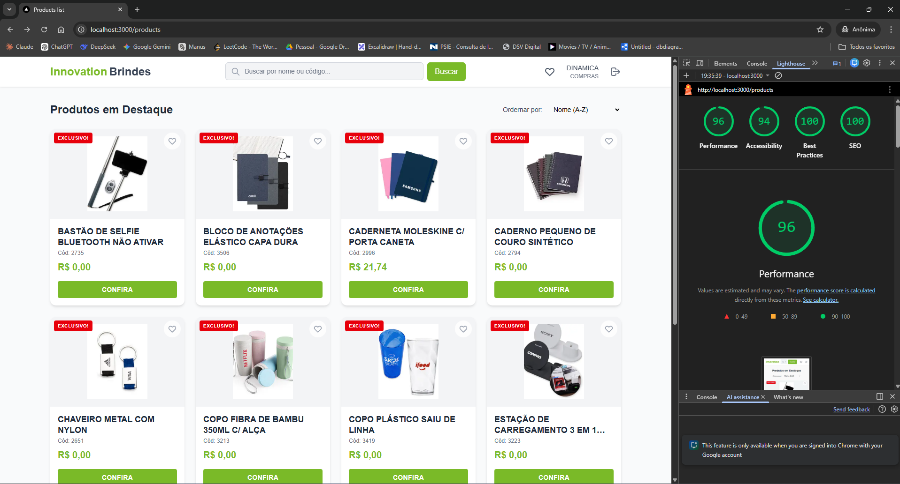

# Products App - Innovation Brindes

Este projeto foi desenvolvido como um teste técnico para a Innovation Brindes.
Trata-se de uma aplicação de catálogo de produtos com autenticação, pesquisa
inteligente, paginação e gerenciamento de favoritos.

## 🚀 Como rodar a aplicação com Docker

Certifique-se de ter o **Docker** e o **Docker Compose** instalados em sua
máquina.

1.  **Clone o repositório:**

    ```bash
    git clone https://github.com/higord3v/products.git
    cd products
    ```

2.  **Configure as variáveis de ambiente:** Crie um arquivo `.env` na raiz do
    projeto (opcional, já existem valores padrão no Dockerfile para fins de
    teste):

    ```env
    SESSION_SECRET=uma_chave_secreta_muito_longa_e_segura_aqui
    ```

3.  **Suba o container:**

    ```bash
    docker-compose up -d --build
    ```

4.  **Acesse a aplicação:** Abra o navegador em
    [http://localhost:3000](http://localhost:3000).

---

## 🛠 Decisões Técnicas

- **Next.js 16 (App Router):** Escolhido pela performance, suporte nativo a
  Server Components e facilidade de roteamento.
- **Tailwind CSS 4:** Utilizado para estilização rápida, responsiva e moderna,
  garantindo fidelidade ao design solicitado.
- **React Query (TanStack Query):** Implementado para gerenciamento eficiente de
  estado assíncrono (cache, loading states, refetching) na listagem de produtos.
- **Zustand:** Utilizado para gerenciamento de estado global leve (armazenamento
  do token de sessão no lado do cliente).
- **Jose:** Biblioteca utilizada para criação e verificação de sessões JWT
  seguras no lado do servidor (Edge runtime ready).
- **Vitest & React Testing Library:** Para testes unitários de componentes e
  hooks.
- **Playwright:** Para testes de ponta a ponta (E2E), garantindo o fluxo crítico
  de login e busca.

### O que ficou pendente / Melhorias Futuras

- **Gerenciamento de Erros Granular:** Tratamento mais específico para erros de
  API além do básico 401.
- **Fila de Favoritos Persistente no Back-end:** Atualmente, os favoritos são
  salvos apenas no LocalStorage do usuário.
- **Skeleton screens mais elaborados:** Melhorar a experiência visual durante o
  carregamento inicial.
- **Carrinho de Compras:** A funcionalidade de "Adicionar ao Carrinho" está
  apenas simulada no modal de detalhes.

---

## 📊 Lighthouse & Demonstração

### Lighthouse Desktop Score



### Fluxo da Aplicação


---

**Desenvolvido por [higord3v](https://github.com/higord3v).**
